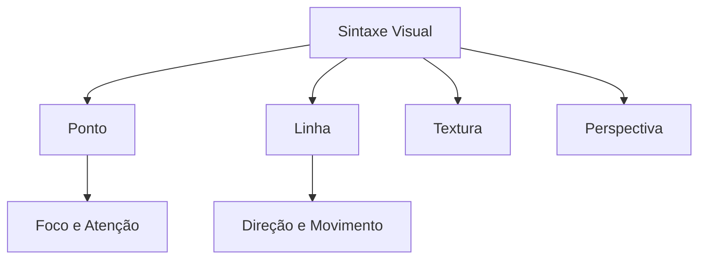

# Introdução ao Design de Interfaces e Instalação

## Objetivos da Aula
- [ ] Compreender os conceitos de Introdução ao Design de Interfaces e Instalação.
- [ ] Praticar as ferramentas relacionadas no Figma.
- [ ] Criar um exemplo prático.

## Conteúdo Teórico

### O que é Design de Interfaces?
O Design de Interfaces (UI Design) é o desenvolvimento de interfaces visuais para aplicativos e sites, focando na experiência do usuário e na estética funcional.

!!! info "Conceito"
    UI (User Interface) é o meio pelo qual um usuário interage com um sistema. É a "ponte" entre o humano e o computador.

### Alfabetismo Visual e Sintaxe
Para criar boas interfaces, precisamos entender os elementos básicos da sintaxe visual:



- **Ponto e Linha:** Os elementos mais simples que guiam o olhar.
- **Textura:** Sensação de superfície que adiciona profundidade.
- **Perspectiva:** Criação de profundidade em planos 2D.

### Gestalt: As Leis da Percepção
A Gestalt estuda como o cérebro agrupa elementos visuais:

1. **Proximidade:** Elementos próximos são vistos como um grupo.
2. **Semelhança:** Elementos parecidos parecem ter a mesma função.
3. **Continuidade:** Seguimos caminhos e linhas fluidas.
4. **Fechamento:** O cérebro completa formas incompletas.

!!! tip "Dica"
    Use a Gestalt para organizar informações sem precisar de muitas linhas divisórias ou bordas pesadas.

### Instalação e Configuração
O Figma pode ser usado via navegador ou aplicativo desktop.

```terminal
$ figma --version
Figma Desktop App v116.15.4
$ open https://www.figma.com/downloads/
```

- [Download do Figma](https://www.figma.com/downloads/)

## Em Prática
Vamos explorar a interface e identificar elementos de Gestalt em sites famosos.

!!! warning "Atenção"
    Certifique-se de validar seu e-mail de conta estudantil para liberar os recursos do Figma Professional gratuitamente.

## Resumo
Nesta aula aprendemos sobre:
- Fundamentos da Sintaxe Visual.
- Princípios da Gestalt aplicados à UI.
- Instalação do ambiente de trabalho.

---
## 🎯 Próximos Passos

<div class="grid cards" markdown>

-   :material-presentation: **Acessar Slides**
    -   [Ver Slides da Aula](../slides/slide-01.html)

-   :material-school: **Quiz**
    -   [Responder Quiz](../quizzes/quiz-01.md)

-   :material-dumbbell: **Exercícios**
    -   [Lista de Exercícios](../exercicios/exercicio-01.md)

-   :material-rocket: **Projeto**
    -   [Mini Projeto](../projetos/projeto-01.md)

</div>
