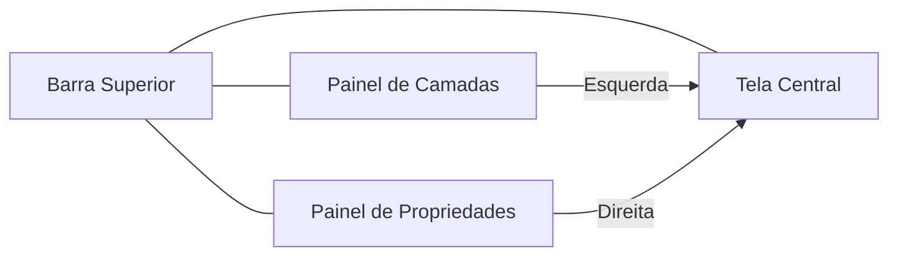

# Explorando a Interface do Figma

## Objetivos da Aula
- [ ] Compreender os conceitos de Explorando a Interface do Figma.
- [ ] Praticar as ferramentas relacionadas no Figma.
- [ ] Criar um exemplo prático.

## Conteúdo Teórico

### Conhecendo a Interface do Figma
A interface do Figma é dividida em quatro áreas principais que facilitam o fluxo de trabalho colaborativo.



- **Barra Superior:** Ferramentas de seleção, formas, caneta e texto.
- **Painel de Camadas (Esquerdo):** Organização de páginas, assets e camadas.
- **Tela Central (Canvas):** Onde o design acontece.
- **Painel de Propriedades (Direito):** Ajustes de dimensão, cor, efeitos e interações.

!!! info "Conceito"
    O Figma é baseado em **frames**. Pense neles como as "telas" do seu aplicativo ou as "artboards" do seu design.

### Atalhos Essenciais
Dominar atalhos é o que diferencia designers produtivos.

```terminal
$ # Atalhos de Navegação
$ Espaço + Clique: Pan (Mover tela)
$ Ctrl + Scroll: Zoom In/Out
$ Alt + L: Recolher todas as camadas
```

!!! tip "Dica"
    Use o atalho `Ctrl + /` para abrir a barra de busca rápida e encontrar qualquer ferramenta ou plugin instantaneamente.

## Em Prática
Vamos criar nosso primeiro **Frame** de iPhone e organizar três camadas simples: um retângulo (Fundo), um círculo (Avatar) e um Texto (Nome).

!!! warning "Atenção"
    Mantenha suas camadas nomeadas desde o primeiro dia. "Rectangle 45" não ajuda ninguém no futuro!

## Resumo
Nesta aula aprendemos sobre:
- Divisão da interface do Figma.
- Navegação fluida no Canvas.
- Atalhos de produtividade básica.

---
## 🎯 Próximos Passos

<div class="grid cards" markdown>

-   :material-presentation: **Acessar Slides**
    -   [Ver Slides da Aula](../slides/slide-02.html)

-   :material-school: **Quiz**
    -   [Responder Quiz](../quizzes/quiz-02.md)

-   :material-dumbbell: **Exercícios**
    -   [Lista de Exercícios](../exercicios/exercicio-02.md)

-   :material-rocket: **Projeto**
    -   [Mini Projeto](../projetos/projeto-02.md)

</div>
