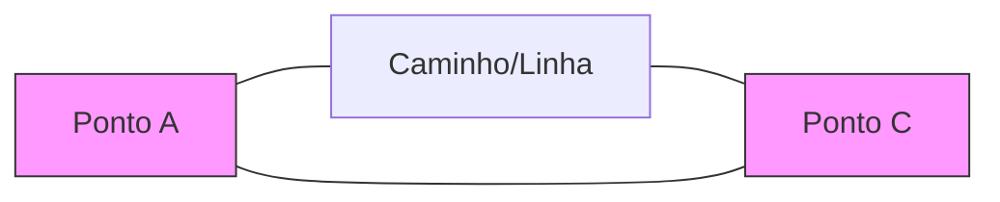

# Ferramentas Básicas: Formas e Vetores

## Objetivos da Aula
- [ ] Compreender os conceitos de Ferramentas Básicas: Formas e Vetores.
- [ ] Praticar as ferramentas relacionadas no Figma.
- [ ] Criar um exemplo prático.

## Conteúdo Teórico

### O que são Vetores?
Diferente de imagens raster, vetores são baseados em cálculos matemáticos. Isso permite redimensionamento infinito sem perda de qualidade.



!!! info "Conceito"
    Um vetor é composto por **Pontos de Ancoragem** e **Curvas de Bézier**. No Figma, usamos a ferramenta Caneta (P) para manipular esses elementos.

### Operações Booleanas
Podemos criar formas complexas combinando formas básicas.

```terminal
$ # Comandos de Combinação
$ Union: Une as formas em uma só
$ Subtract: Remove a forma de cima da de baixo
$ Intersect: Mantém apenas onde as formas se cruzam
```

!!! tip "Dica"
    Ao desenhar um círculo ou quadrado perfeito, mantenha a tecla `Shift` pressionada durante a criação.

### Opções Open Source (Código Aberto)
Além do Figma, existem excelentes alternativas gratuitas:
- **[Inkscape](https://inkscape.org/):** Editor de vetores de mesa robusto.
- **[Penpot](https://penpot.app/):** Design e prototipagem open source via web.

## Em Prática
Vamos construir um ícone de "Cloud" (Nuvem) combinando três círculos e um retângulo usando a operação de **Union**.

!!! warning "Atenção"
    Sempre prefira vetores para logotipos e ícones. Imagens bitmap (fotos) ficam borradas ao serem ampliadas!

## Resumo
Nesta aula aprendemos sobre:
- Natureza matemática dos vetores.
- Manipulação de formas com a Pen Tool.
- Operações de combinação (Boolean).

---
## 🎯 Próximos Passos

<div class="grid cards" markdown>

-   :material-presentation: **Acessar Slides**
    -   [Ver Slides da Aula](../slides/slide-03.html)

-   :material-school: **Quiz**
    -   [Responder Quiz](../quizzes/quiz-03.md)

-   :material-dumbbell: **Exercícios**
    -   [Lista de Exercícios](../exercicios/exercicio-03.md)

-   :material-rocket: **Projeto**
    -   [Mini Projeto](../projetos/projeto-03.md)

</div>
