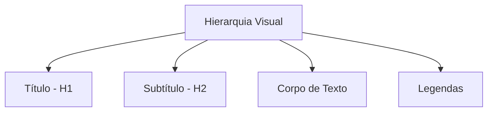

# Manipulação de Textos e Tipografia

## Objetivos da Aula
- [ ] Compreender os conceitos de Manipulação de Textos e Tipografia.
- [ ] Praticar as ferramentas relacionadas no Figma.
- [ ] Criar um exemplo prático.

## Conteúdo Teórico

### Tipografia e Hierarquia Visual
O texto é 90% do design da interface. Uma boa tipografia garante legibilidade e guia o usuário através da informação.



- **Famílias Tipográficas:** Serif, Sans Serif, Monospaced e Display.
- **Hierarquia:** Use tamanho (size), peso (weight) e cor para destacar o que é importante.
- **Legibilidade:** Espaçamento entre linhas (line-height) e entre letras (letter-spacing).

!!! info "Conceito"
    A hierarquia visual é a ordenação estratégica dos elementos para que o usuário perceba primeiro a informação mais importante.

### Manipulação de Texto no Figma
Ajustes precisos de tipografia no painel lateral direito.

```terminal
$ # Comandos de Atributos
$ Text Align: Esquerda, Centro, Direita ou Justificado
$ Case: Uppercase, Lowercase, Title Case
$ Decoration: Underline, Strikethrough
```

!!! tip "Dica"
    Ao escolher fontes, verifique se elas possuem diferentes "pesos" (Light, Regular, Bold). Isso dá muito mais flexibilidade ao seu design.

## Em Prática
Vamos criar uma **Escala Tipográfica** para um site de notícias, definindo estilos para Título, Subtítulo e Parágrafo.

!!! warning "Atenção"
    Evite usar mais de 2 ou 3 fontes diferentes no mesmo projeto. A simplicidade gera consistência!

## Resumo
Nesta aula aprendemos sobre:
- Classificação de fontes.
- Princípios de hierarquia visual.
- Configuração de textos no Figma.

---
## 🎯 Próximos Passos

<div class="grid cards" markdown>

-   :material-presentation: **Acessar Slides**
    -   [Ver Slides da Aula](../slides/slide-04.html)

-   :material-school: **Quiz**
    -   [Responder Quiz](../quizzes/quiz-04.md)

-   :material-dumbbell: **Exercícios**
    -   [Lista de Exercícios](../exercicios/exercicio-04.md)

-   :material-rocket: **Projeto**
    -   [Mini Projeto](../projetos/projeto-04.md)

</div>
