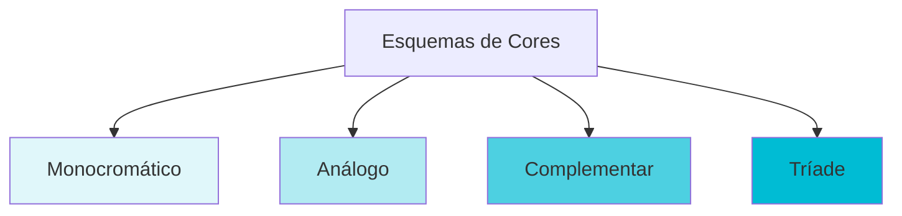

# Teoria das Cores e Aplicação no Figma

## Objetivos da Aula
- [ ] Compreender os conceitos de Teoria das Cores e Aplicação no Figma.
- [ ] Praticar as ferramentas relacionadas no Figma.
- [ ] Criar um exemplo prático.

## Conteúdo Teórico

### Teoria das Cores na Prática
As cores evocam emoções e ajudam na usabilidade. Entender o círculo cromático é essencial para criar paletas harmoniosas.



- **Sistemas de Cores:** RGB (Digital), CMYK (Impressão) e HEX (Código).
- **Psicologia das Cores:** Azul (Confiança), Vermelho (Urgência/Erro), Verde (Sucesso).
- **Contraste:** Garanta que o texto seja legível sobre o fundo (Padrões WCAG).

!!! info "Conceito"
    O contraste não é apenas sobre a cor, mas sobre a diferença de luminância. Use ferramentas de inspeção para garantir a acessibilidade.

### Aplicação no Figma
Trabalhando com preenchimentos (Fill) e contornos (Stroke).

```terminal
$ # Comandos de Cor
$ I: Conta-gotas (Eye Dropper)
$ Alt + Ctrl + C: Copiar Cor/Estilo
$ Alt + Ctrl + V: Colar Cor/Estilo
```

!!! tip "Dica"
    Ao criar uma interface, use a regra 60-30-10: 60% cor primária (neutra), 30% cor secundária e 10% cor de destaque (CTA).

## Em Prática
Vamos criar uma paleta de cores para um aplicativo de saúde, utilizando harmonia análoga e testando o contraste.

!!! warning "Atenção"
    Sempre teste seu design em diferentes telas. Uma cor que parece ótima no seu monitor pode ficar apagada em um celular barato!

## Resumo
Nesta aula aprendemos sobre:
- Círculo cromático e harmonias.
- Modelos de cores digitais.
- Acessibilidade e contraste.

---
## 🎯 Próximos Passos

<div class="grid cards" markdown>

-   :material-presentation: **Acessar Slides**
    -   [Ver Slides da Aula](../slides/slide-05.html)

-   :material-school: **Quiz**
    -   [Responder Quiz](../quizzes/quiz-05.md)

-   :material-dumbbell: **Exercícios**
    -   [Lista de Exercícios](../exercicios/exercicio-05.md)

-   :material-rocket: **Projeto**
    -   [Mini Projeto](../projetos/projeto-05.md)

</div>
