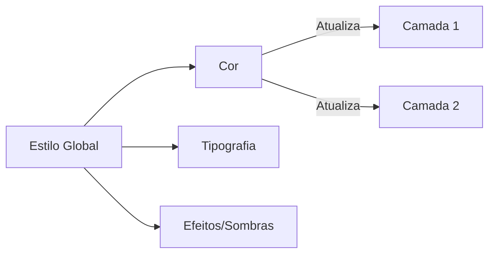

# Gerenciamento de Estilos (Styles)

## Objetivos da Aula
- [ ] Compreender os conceitos de Gerenciamento de Estilos (Styles).
- [ ] Praticar as ferramentas relacionadas no Figma.
- [ ] Criar um exemplo prático.

## Conteúdo Teórico

### Gestão de Estilos (Styles)
Para manter a consistência e agilizar o trabalho em equipe, usamos estilos globais para cores, textos e efeitos.



- **Vantagens:** Mudou o estilo em um lugar, muda em todo o projeto.
- **Tipos de Estilos:** Color Styles, Text Styles e Effect Styles (Glow, Drop Shadow).
- **Organização:** Use barras `/` para criar pastas (ex: `Brand/Primary`).

!!! info "Conceito"
    Estilos são o primeiro passo para criar um **Design System**. Eles garantem que todos os designers usem a mesma "língua" visual.

### Como Criar no Figma
O painel de estilos fica visível quando nenhum elemento está selecionado.

```terminal
$ # Atalhos de Estilos
$ Ctrl + Alt + C: Copiar propriedades
$ Ctrl + Alt + V: Aplicar propriedades
$ Edit Style: Clique no ícone de quatro pontos (Grid)
```

!!! tip "Dica"
    Sempre nomeie seus estilos de acordo com a função, não com a cor. Use `Primary Action` em vez de `Blue`, pois a cor pode mudar no futuro!

## Em Prática
Vamos converter nossa paleta da Aula 05 em **Color Styles** oficiais e criar nossos primeiros **Text Styles** para títulos e corpos.

!!! warning "Atenção"
    Camadas vinculadas a estilos não permitem mudanças de cor manuais. Você deve "desvincular" ou editar o estilo global.

## Resumo
Nesta aula aprendemos sobre:
- Padronização com estilos globais.
- Criação de bibliotecas locais de cores e textos.
- Organização profissional de assets.

---
## 🎯 Próximos Passos

<div class="grid cards" markdown>

-   :material-presentation: **Acessar Slides**
    -   [Ver Slides da Aula](../slides/slide-06.html)

-   :material-school: **Quiz**
    -   [Responder Quiz](../quizzes/quiz-06.md)

-   :material-dumbbell: **Exercícios**
    -   [Lista de Exercícios](../exercicios/exercicio-06.md)

-   :material-rocket: **Projeto**
    -   [Mini Projeto](../projetos/projeto-06.md)

</div>
