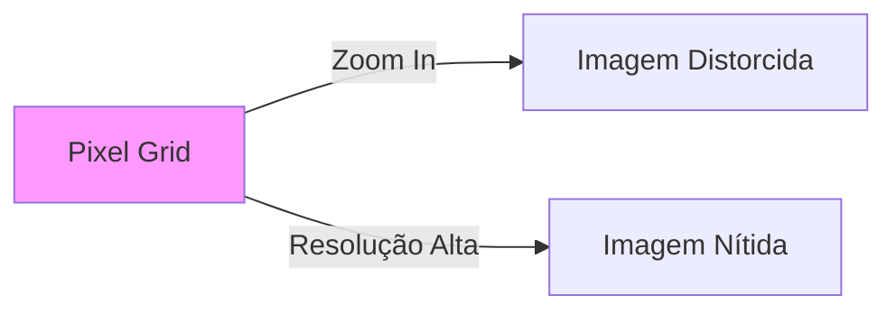

# Trabalhando com Imagens e Máscaras

## Objetivos da Aula
- [ ] Compreender os conceitos de Trabalhando com Imagens e Máscaras.
- [ ] Praticar as ferramentas relacionadas no Figma.
- [ ] Criar um exemplo prático.

## Conteúdo Teórico

### Imagens Raster (Bitmap)
Imagens compostas por pixels. Diferente dos vetores, elas perdem qualidade ao serem ampliadas.



- **Tamanho vs Resolução:** A densidade (PPI) é crucial para telas Retina.
- **Máscaras:** Ocultar partes de uma imagem de forma não-destrutiva.
- **Formatos:** PNG (transparência), JPG (fotos), WebP (moderno/leve).

!!! info "Conceito"
    A transparência é controlada pelo **Canal Alpha**. No Figma, podemos usar máscaras de qualquer forma geométrica ou vetor para "cortar" imagens.

### Manipulação e Retoque
Filtros de ajuste rápidos diretamente no Figma.

```terminal
$ # Ajustes de Imagem
$ Exposure: Brilho/Luz
$ Contrast: Diferença entre claros e escuros
$ Saturation: Intensidade da cor
```

!!! tip "Dica"
    Para retoques avançados de pele ou remoção de objetos, utilize o **GIMP** ou **Krita** (Open Source) antes de importar para o Figma.

## Em Prática
Vamos importar uma foto, aplicar um ajuste de luminância e criar uma máscara de recorte hexagonal para um perfil de usuário.

!!! warning "Atenção"
    Cuidado com o tamanho dos arquivos! Imagens muito pesadas deixam o arquivo do Figma lento e o carregamento do site/app demorado.

## Resumo
Nesta aula aprendemos sobre:
- Diferenças técnicas entre Bitmap e Vetor.
- Uso de máscaras no Figma.
- Otimização e softwares Open Source.

---
## 🎯 Próximos Passos

<div class="grid cards" markdown>

-   :material-presentation: **Acessar Slides**
    -   [Ver Slides da Aula](../slides/slide-07.html)

-   :material-school: **Quiz**
    -   [Responder Quiz](../quizzes/quiz-07.md)

-   :material-dumbbell: **Exercícios**
    -   [Lista de Exercícios](../exercicios/exercicio-07.md)

-   :material-rocket: **Projeto**
    -   [Mini Projeto](../projetos/projeto-07.md)

</div>
