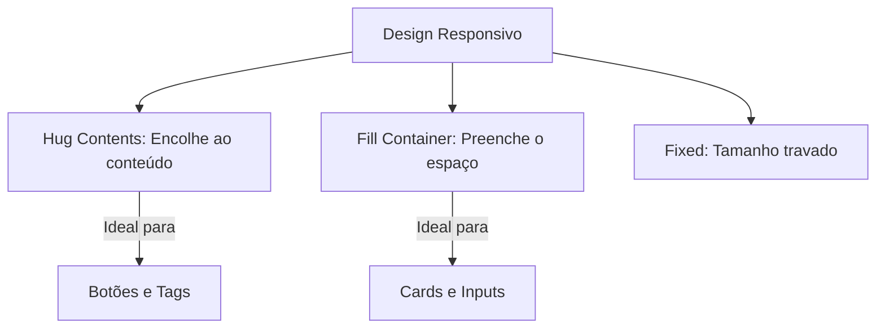

# Auto Layout: Avançado e Responsividade

## Objetivos da Aula
- [ ] Compreender os conceitos de Auto Layout: Avançado e Responsividade.
- [ ] Praticar as ferramentas relacionadas no Figma.
- [ ] Criar um exemplo prático.

## Conteúdo Teórico

### Layout Fluido e Responsivo
No mundo real, interfaces são visualizadas em telas de diversos tamanhos. O design responsivo adapta o layout para garantir a melhor experiência em qualquer dispositivo.



- **Hug Contents:** O frame se ajusta ao tamanho do que está dentro.
- **Fill Container:** O elemento interno se estica para preencher o frame pai.
- **Fixed Width/Height:** O elemento mantém o tamanho exato, independente do contexto.

!!! info "Conceito"
    A responsividade no Figma é construída combinando Auto Layout com as configurações de redimensionamento (Resizing).

### Wrap (Quebra de Linha)
Recurso moderno que permite que itens "pulem" para a linha de baixo quando não houver mais espaço.

```terminal
$ # Configurações de Fluxo
$ Vertical: Itens em pé
$ Horizontal: Itens deitados
$ Wrap: Quebra automática (Estilo Grid)
```

!!! tip "Dica"
    Ao projetar um card com imagem e texto, use `Fill Container` no texto para que ele ocupe todo o espaço restante ao lado da imagem.

## Em Prática
Vamos construir uma galeria de fotos que se adapta automaticamente de 3 colunas para 1 coluna conforme diminuímos a largura do frame pai.

!!! warning "Atenção"
    Sempre teste seu layout esticando e encolhendo o frame. Se os elementos "quebrarem" ou ficarem sobrepostos, ajuste o Resizing!

## Resumo
Nesta aula aprendemos sobre:
- Hug vs Fill vs Fixed.
- Fluxo de Wrap para listas dinâmicas.
- Criando componentes que funcionam em Mobile e Desktop.

---
## 🎯 Próximos Passos

<div class="grid cards" markdown>

-   :material-presentation: **Acessar Slides**
    -   [Ver Slides da Aula](../slides/slide-09.html)

-   :material-school: **Quiz**
    -   [Responder Quiz](../quizzes/quiz-09.md)

-   :material-dumbbell: **Exercícios**
    -   [Lista de Exercícios](../exercicios/exercicio-09.md)

-   :material-rocket: **Projeto**
    -   [Mini Projeto](../projetos/projeto-09.md)

</div>
