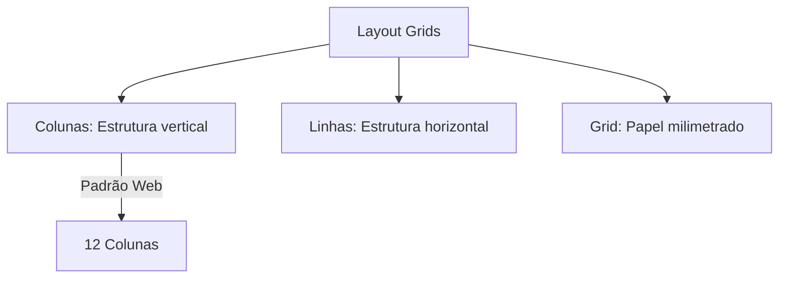

# Constraints e Grids

## Objetivos da Aula
- [ ] Compreender os conceitos de Constraints e Grids.
- [ ] Praticar as ferramentas relacionadas no Figma.
- [ ] Criar um exemplo prático.

## Conteúdo Teórico

### Constraints e Grids
Enquanto o Auto Layout cuida do conteúdo interno, as **Constraints** (Restrições) cuidam de como os elementos se fixam em relação ao Frame pai.



- **Constraints:** Fixar itens na Esquerda, Direita, Centro ou "Scale".
- **Layout Grids:** Guiais visuais para alinhar elementos com precisão matemática.
- **8pt Grid System:** Recomendação de usar múltiplos de 8 para todos os espaçamentos e tamanhos.

!!! info "Conceito"
    As Constraints dizem ao Figma: "Se esta tela crescer, mantenha este logotipo sempre fixo no canto superior direito".

### Configurando o Grid
Grids são essenciais para manter a harmonia entre diferentes telas.

```terminal
$ # Configurações de Grid
$ Type: Stretch (Esticar), Center ou Left/Right
$ Gutter: Espaço entre colunas (Respiro)
$ Margin: Espaço nas bordas laterais
```

!!! tip "Dica"
    Use um Grid de 12 colunas para Web e um de 4 colunas para Mobile. Isso é o padrão que desenvolvedores Front-end esperam receber.

## Em Prática
Vamos configurar uma grade de 12 colunas em um Frame de Desktop e usar Constraints para fixar um menu de navegação no topo (Top + Scale).

!!! warning "Atenção"
    Constraints só funcionam em Frames simples. Se você adicionar Auto Layout ao frame pai, as Constraints serão substituídas pelas regras de alinhamento do Auto Layout.

## Resumo
Nesta aula aprendemos sobre:
- Fixação de elementos com Constraints.
- Alinhamento profissional com Layout Grids.
- O sistema de 8 pontos para design consistente.

---
## 🎯 Próximos Passos

<div class="grid cards" markdown>

-   :material-presentation: **Acessar Slides**
    -   [Ver Slides da Aula](../slides/slide-10.html)

-   :material-school: **Quiz**
    -   [Responder Quiz](../quizzes/quiz-10.md)

-   :material-dumbbell: **Exercícios**
    -   [Lista de Exercícios](../exercicios/exercicio-10.md)

-   :material-rocket: **Projeto**
    -   [Mini Projeto](../projetos/projeto-10.md)

</div>
