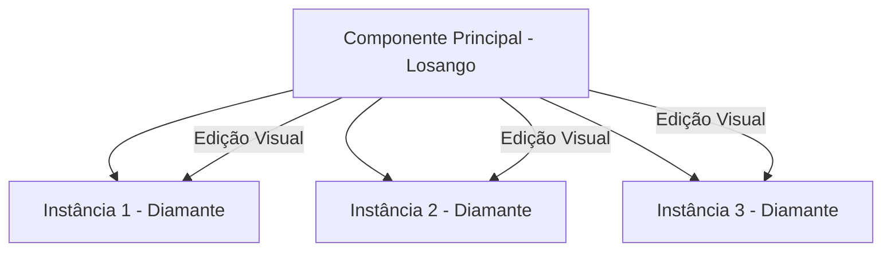

# Componentes Básicos e Instâncias

## Objetivos da Aula
- [ ] Compreender os conceitos de Componentes Básicos e Instâncias.
- [ ] Praticar as ferramentas relacionadas no Figma.
- [ ] Criar um exemplo prático.

## Conteúdo Teórico

### Componentes e Instâncias
Um componente é um elemento mestre que você pode reutilizar em todo o seu design. Quando você edita o Componente Principal, todas as suas Instâncias são atualizadas automaticamente.



- **Main Component:** O original, identificado pelo ícone de 4 losangos preenchidos.
- **Instance:** Uma cópia ligada ao original, identificada por 1 losango contornado.
- **Overrides:** Alterações locais feitas em uma instância (como mudar o texto de um botão) que não afetam o original.

!!! info "Conceito"
    Componentes são como classes em programação. Você define a lógica e o visual uma vez e cria objetos (instâncias) a partir dela.

### Gerenciamento de Assets
O Figma facilita a busca e o uso de componentes através do painel "Assets".

```terminal
$ # Atalhos de Componentes
$ Ctrl + Alt + K: Criar Componente
$ Alt + Arrastar: Criar uma Instância
$ Reset Instance: Volta às propriedades originais do mestre
```

!!! tip "Dica"
    Use `Right Click > Main Component > Go to Main Component` para encontrar rapidamente o componente mestre de qualquer instância.

## Em Prática
Vamos criar um componente de "Card de Produto" e gerar 5 instâncias, mudando apenas a imagem e o preço de cada uma usando Overrides.

!!! warning "Atenção"
    Evite "desvincular" instâncias (Detach Instance). Isso quebra a conexão com o mestre e torna a manutenção do projeto muito mais difícil.

## Resumo
Nesta aula aprendemos sobre:
- Relação entre Mestre e Instância.
- Uso de Overrides para personalização.
- Organização do painel de Assets.

---
## 🎯 Próximos Passos

<div class="grid cards" markdown>

-   :material-presentation: **Acessar Slides**
    -   [Ver Slides da Aula](../slides/slide-11.html)

-   :material-school: **Quiz**
    -   [Responder Quiz](../quizzes/quiz-11.md)

-   :material-dumbbell: **Exercícios**
    -   [Lista de Exercícios](../exercicios/exercicio-11.md)

-   :material-rocket: **Projeto**
    -   [Mini Projeto](../projetos/projeto-11.md)

</div>
