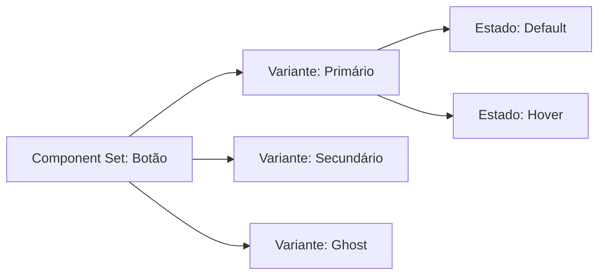

# Variantes e Propriedades de Componentes

## Objetivos da Aula
- [ ] Compreender os conceitos de Variantes e Propriedades de Componentes.
- [ ] Praticar as ferramentas relacionadas no Figma.
- [ ] Criar um exemplo prático.

## Conteúdo Teórico

### Variantes e Propriedades
Variantes permitem organizar componentes similares em um único contêiner. Por exemplo, um botão com estados "Default", "Hover" e "Disabled".



- **Component Sets:** O contêiner que agrupa as variantes.
- **Properties:** Atributos que você define (Cor, Tamanho, Ícone Sim/Não).
- **Boolean Properties:** Ligar ou desligar a visibilidade de uma camada com um clique.

!!! info "Conceito"
    Variantes limpam seu painel de Assets. Em vez de ter 20 botões diferentes, você tem 1 botão com menus de configuração.

### Tipos de Propriedades
Organize como você interage com seus componentes no painel direito.

```terminal
$ # Configuração de Propriedades
$ Variant: Troca entre visuais diferentes
$ Boolean: Alterna visibilidade (True/False)
$ Text: Permite editar o texto diretamente no painel
$ Content: Troca instâncias de ícones
```

!!! tip "Dica"
    Use nomes lógicos para suas propriedades. Em vez de `Property 1`, use `Status` ou `Type`. Isso facilita a compreensão de outros designers.

## Em Prática
Vamos criar um componente de "Input de Texto" com variantes para os estados: Vazio, Preenchido e Com Erro.

!!! warning "Atenção"
    Não exagere nas variantes! Se você tiver milhares de combinações para um único componente, talvez seja melhor dividi-lo em componentes menores.

## Resumo
Nesta aula aprendemos sobre:
- Organização com Component Sets.
- Criação de propriedades booleanas e de texto.
- Simplificação da biblioteca de design.

---
## 🎯 Próximos Passos

<div class="grid cards" markdown>

-   :material-presentation: **Acessar Slides**
    -   [Ver Slides da Aula](../slides/slide-12.html)

-   :material-school: **Quiz**
    -   [Responder Quiz](../quizzes/quiz-12.md)

-   :material-dumbbell: **Exercícios**
    -   [Lista de Exercícios](../exercicios/exercicio-12.md)

-   :material-rocket: **Projeto**
    -   [Mini Projeto](../projetos/projeto-12.md)

</div>
