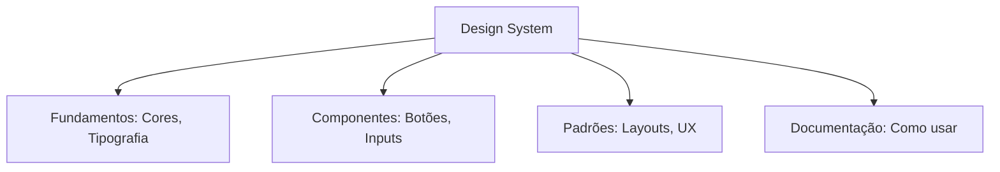

# Bibliotecas e Design Systems

## Objetivos da Aula
- [ ] Compreender os conceitos de Bibliotecas e Design Systems.
- [ ] Praticar as ferramentas relacionadas no Figma.
- [ ] Criar um exemplo prático.

## Conteúdo Teórico

### Bibliotecas e Design Systems
Um Design System é a "fonte da verdade" de uma empresa. Ele vai além de componentes visuais, incluindo documentação, tom de voz e regras de uso.



- **Bibliotecas de Equipe:** Publique seus estilos e componentes para que outros arquivos possam usá-los.
- **Tokens de Design:** Valores semânticos que ligam o design ao código (ex: `color-primary-main`).
- **Escalabilidade:** Permite que centenas de designers e desenvolvedores trabalhem no mesmo produto com consistência.

!!! info "Conceito"
    Design System não é um projeto com fim. É um **produto vivo** que cresce e evolui conforme a necessidade do negócio e dos usuários.

### Ecossistema de Apoio
Designers não criam tudo do zero. Usamos recursos externos para acelerar o processo.

```terminal
$ # Recursos Digitais
$ Imagens: Unsplash, Pexels
$ Ícones: FontAwesome, Lucide
$ Ilustrações: Humaaans, Undraw
```

!!! tip "Dica"
    Ao usar bancos de imagens, procure por fotos que tenham a mesma iluminação e estilo visual para manter a unidade do seu Design System.

## Em Prática
Vamos criar uma biblioteca de ícones pictográficos e organizar nosso primeiro "Mini Design System" com cores, fontes e 3 componentes básicos.

!!! warning "Atenção"
    Um Design System sem documentação é apenas um arquivo de UI Kit. Explique o **PORQUÊ** das decisões, não apenas o como.

## Resumo
Nesta aula aprendemos sobre:
- Conceito de Design System vs UI Kit.
- Publicação de bibliotecas no Figma.
- Integração de elementos de apoio (ícones e imagens).

---
## 🎯 Próximos Passos

<div class="grid cards" markdown>

-   :material-presentation: **Acessar Slides**
    -   [Ver Slides da Aula](../slides/slide-13.html)

-   :material-school: **Quiz**
    -   [Responder Quiz](../quizzes/quiz-13.html)

-   :material-dumbbell: **Exercícios**
    -   [Lista de Exercícios](../exercicios/exercicio-13.md)

-   :material-rocket: **Projeto**
    -   [Mini Projeto](../projetos/projeto-13.md)

</div>
