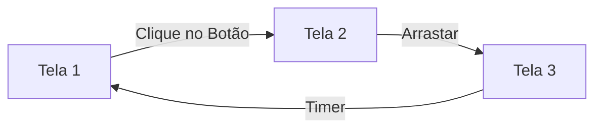

# Prototipagem: Navegação e Interações

## Objetivos da Aula
- [ ] Compreender os conceitos de Prototipagem: Navegação e Interações.
- [ ] Praticar as ferramentas relacionadas no Figma.
- [ ] Criar um exemplo prático.

## Conteúdo Teórico

### Prototipagem e Interatividade
Prototipagem é o processo de simular a experiência real do produto. No Figma, conectamos telas e elementos para criar fluxos navegáveis.



- **Connections:** Setas azuis que ligam o ponto de partida ao destino.
- **Triggers:** O que inicia a ação (On Click, On Drag, While Hovering).
- **Actions:** O que acontece (Navigate to, Open Overlay, Back).
- **Animations:** Como a transição ocorre (Instant, Dissolve, Smart Animate).

!!! info "Conceito"
    Um protótipo de **Alta Fidelidade** se parece e se comporta como um aplicativo real, sendo ideal para testes com usuários antes do desenvolvimento.

### Smart Animate
A mágica do Figma! Ele identifica elementos com o mesmo nome em telas diferentes e anima as mudanças de posição, cor e tamanho.

```terminal
$ # Configurações de Animação
$ Ease In/Out: Aceleração natural
$ Spring: Efeito de mola/quique
$ Custom: Curva de Bezier personalizada
```

!!! tip "Dica"
    Para que o **Smart Animate** funcione, as camadas devem ter EXATAMENTE o mesmo nome em ambas as telas.

## Em Prática
Vamos criar um fluxo de "Login" onde, ao clicar no botão "Entrar", o usuário é levado para a "Home" com uma animação de deslizar (Push).

!!! warning "Atenção"
    Protótipos muito grandes podem ficar lentos no modo de apresentação. Divida seu projeto em múltiplos fluxos se houver muitas telas.

## Resumo
Nesta aula aprendemos sobre:
- Gatilhos e ações de prototipagem.
- Uso de Overlays para menus e modais.
- Criação de animações fluídas com Smart Animate.

---
## 🎯 Próximos Passos

<div class="grid cards" markdown>

-   :material-presentation: **Acessar Slides**
    -   [Ver Slides da Aula](../slides/slide-14.html)

-   :material-school: **Quiz**
    -   [Responder Quiz](../quizzes/quiz-14.md)

-   :material-dumbbell: **Exercícios**
    -   [Lista de Exercícios](../exercicios/exercicio-14.md)

-   :material-rocket: **Projeto**
    -   [Mini Projeto](../projetos/projeto-14.md)

</div>
