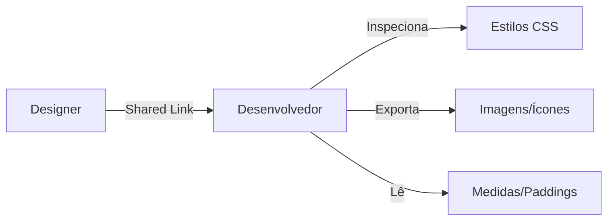

# Animações (Smart Animate) e Microinterações

## Objetivos da Aula
- [ ] Compreender os conceitos de Animações (Smart Animate) e Microinterações.
- [ ] Praticar as ferramentas relacionadas no Figma.
- [ ] Criar um exemplo prático.

## Conteúdo Teórico

### Handover: Do Design ao Código
O Handover é o momento em que o design é entregue aos desenvolvedores. O Figma possui ferramentas específicas para facilitar essa comunicação.



- **Dev Mode:** Interface focada em código (CSS, Swift, Kotlin).
- **Inspeção:** Ver medidas, cores HEX e propriedades de texto com um clique.
- **Exportação:** Gerar arquivos PNG, SVG ou PDF em diferentes escalas (1x, 2x, 3x).

!!! info "Conceito"
    Um bom handover reduz o atrito e garante que o produto final seja fiel ao que foi projetado.

### Plugins de Exportação
Existem plugins que convertem designs diretamente para código funcional.

```terminal
$ # Ferramentas de Handover
$ Zeplin/Avocode: Plataformas externas de entrega
$ Figma to Code: Plugin para HTML/Tailwind/Flutter
$ Anima: Criação de protótipos funcionais com código
```

!!! tip "Dica"
    Sempre marque seus ícones como "Exportable" no painel direito. Isso permite que o desenvolvedor baixe tudo de uma vez.

## Em Prática
Vamos simular o papel de um desenvolvedor, inspecionando o CSS de um botão e exportando um ícone em formato SVG.

!!! warning "Atenção"
    Não "jogue" o arquivo para o dev. Faça uma reunião de entrega, explique os fluxos e tire dúvidas sobre limitações técnicas.

## Resumo
Nesta aula aprendemos sobre:
- Fluxo de trabalho colaborativo (Designer-Dev).
- Uso do Dev Mode e Ferramentas de Inspeção.
- Melhores práticas de exportação de assets.

---
## 🎯 Próximos Passos

<div class="grid cards" markdown>

-   :material-presentation: **Acessar Slides**
    -   [Ver Slides da Aula](../slides/slide-15.html)

-   :material-school: **Quiz**
    -   [Responder Quiz](../quizzes/quiz-15.md)

-   :material-dumbbell: **Exercícios**
    -   [Lista de Exercícios](../exercicios/exercicio-15.md)

-   :material-rocket: **Projeto**
    -   [Mini Projeto](../projetos/projeto-15.md)

</div>
