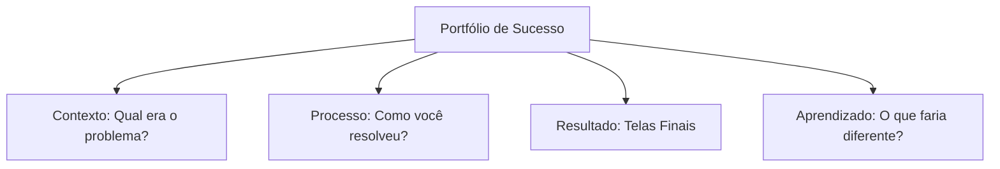

# Hand-off para Desenvolvedores e Exportação

## Objetivos da Aula
- [ ] Compreender os conceitos de Hand-off para Desenvolvedores e Exportação.
- [ ] Praticar as ferramentas relacionadas no Figma.
- [ ] Criar um exemplo prático.

## Conteúdo Teórico

### Construindo seu Portfólio de UI
O portfólio é sua principal ferramenta para conseguir oportunidades no mercado. Ele deve mostrar não apenas o resultado final, mas o seu processo de pensamento.



- **Plataformas:** Behance, Dribbble ou site pessoal (Framer/Webflow).
- **Case Studies:** Narre a jornada do projeto. Use textos curtos e muitas imagens de qualidade.
- **Mockups:** Use modelos 3D de iPhones ou Laptops para dar contexto real aos seus designs.

!!! info "Conceito"
    Recrutadores não buscam apenas "designs bonitos", eles buscam designers que sabem resolver problemas reais de usuários e negócios.

### Presença Profissional
Como se destacar na comunidade de design.

```terminal
$ # Canais de Divulgação
$ LinkedIn: Networking e vagas
$ Behance: Portfólio visual detalhado
$ Dribbble: "Vitrine" de shots rápidos
```

!!! tip "Dica"
    Publique seus projetos no LinkedIn marcando as ferramentas utilizadas e descrevendo um pouco do desafio. Isso aumenta muito sua visibilidade!

## Em Prática
Vamos montar o layout da primeira página do seu estudo de caso, focando na capa e na descrição do problema.

!!! warning "Atenção"
    Não coloque tudo o que você fez no portfólio. Selecione seus **3 melhorores projetos**. Qualidade supera quantidade!

## Resumo
Nesta aula aprendemos sobre:
- Estrutura de um Case Study.
- Melhores plataformas para designers.
- Como se apresentar ao mercado de trabalho.

---
## 🎯 Próximos Passos

<div class="grid cards" markdown>

-   :material-presentation: **Acessar Slides**
    -   [Ver Slides da Aula](../slides/slide-16.html)

-   :material-school: **Quiz**
    -   [Responder Quiz](../quizzes/quiz-16.md)

-   :material-dumbbell: **Exercícios**
    -   [Lista de Exercícios](../exercicios/exercicio-16.md)

-   :material-rocket: **Projeto**
    -   [Mini Projeto](../projetos/projeto-16.md)

</div>
